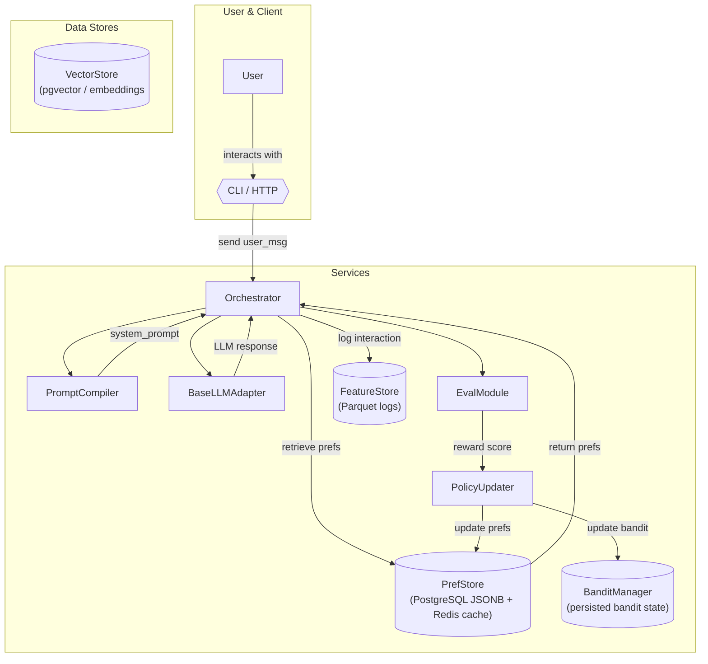

# Architecture Specification

## Overview

This project implements a **two‑layer agentic stack** that wraps a frozen base LLM with an adaptive policy/prompt layer.  The outer layer dynamically assembles a system prompt based on live user data and interaction logs, then routes the assembled prompt to a base LLM adapter.  It records responses and user feedback to continuously refine future prompts using simple bandit/RL‑lite logic.  The design emphasizes modularity, testability and cloud‑agnostic deployment.

### High‑Level Data Flow



1. **User** interacts through a CLI or HTTP endpoint.  The orchestrator logs the raw input.
2. **PrefStore** returns the current user profile and task preferences from a JSONB column in PostgreSQL.  In development it may fall back to SQLite, while production uses PostgreSQL with a Redis hot cache.  Embeddings are stored separately in a dedicated `VectorStore` table using the `pgvector` extension to avoid overloading the preferences table.
3. **PromptCompiler** uses Jinja2 templates and stored preferences to assemble the system prompt.  The compiled prompt includes policy snippets selected via bandit logic.
4. **BaseLLMAdapter** hides the underlying LLM API (e.g. OpenAI).  It formats requests, sends them, and returns the raw response.
5. **EvalModule** applies simple heuristic rules and/or an optional LLM evaluator to compute a reward for the response.  The reward guides the bandit.
6. **PolicyUpdater** updates the user profile with feedback signals and logs features to the **FeatureStore**.  It also updates a multi‑armed bandit or RL‑lite model in **BanditManager**, which influences future prompt snippet selection.  Bandit arm posteriors are persisted per user/task in PostgreSQL so learning survives restarts.

## Component Responsibilities & Technology Choices

| Component | Responsibility | Tech Stack |
|---|---|---|
| **CLI/HTTP server** | Entrypoint for user interaction; routes requests to orchestrator. | Python `click` for CLI, FastAPI for HTTP endpoint |
| **Orchestrator** (`services/orchestrator.py`) | Core loop: collects inputs, retrieves prefs, compiles prompt, calls base LLM, evaluates output, logs features, and updates policies. | Plain Python module |
| **PrefStore** (`store/pref_store.py`) | CRUD layer for user and task preferences stored in a normalized JSONB column.  Uses PostgreSQL for persistence with a Redis hot cache.  Does **not** store embeddings. | SQLAlchemy, Redis client (`redis-py`), optional SQLite fallback |
| **VectorStore** (`store/vector_store.py`) | Persists embeddings separately from preferences using `pgvector`.  Supports approximate nearest‑neighbour search for contextual snippet retrieval. | SQLAlchemy with `pgvector` extension |
| **FeatureStore** (`store/feature_store.py`) | Persists interaction logs and extracted features for offline analysis. Uses Parquet via Polars for speed; can fall back to CSV for debugging. | Polars |
| **BanditManager** (`policy/bandit.py`) | Manages multi‑armed bandit or RL‑lite algorithms for selecting prompt snippets.  Persists arm parameters per user/task in PostgreSQL to survive restarts. | Custom Python implementation or `mab` library |
| **PromptCompiler** (`prompt/compiler.py`) | Loads Jinja2 or Handlebars templates from `prompt_templates/`, fills them with preference data and selected snippets. | `jinja2` |
| **BaseLLMAdapter** (`llm/openai.py`) | Wraps OpenAI’s API, exposing a `BASE_LLM_CALL` interface.  Supports swapping to local models by subclassing the same interface. | `openai` Python SDK |
| **PolicyUpdater** (`policy/updater.py`) | Updates preferences and bandit state based on evaluation results; interacts with PrefStore and BanditManager. | Plain Python |
| **EvalModule** (`eval/heuristics.py`, `eval/eval_llm.py`) | Computes reward scores.  Heuristics can include regex and metadata checks.  Optionally, call a secondary evaluation LLM. | Python functions, optional LLM call |
| **GuardrailLayer** (`services/guardrails.py`) | Applies regex/LLM checks on final outputs to prevent leaking secrets or unsafe responses. | Simple regex, optional `profanity-check` |
| **Configuration** (`config.py`) | Centralised settings loaded via a single Pydantic `Settings` class.  The Settings instance is dependency‑injected throughout the system; modules do **not** call `os.getenv` directly. | Pydantic |
| **PromptLinter** (`prompt/linter.py`) | Enforces prompt budget constraints (e.g., maximum token counts and allowed sections) before sending to the base LLM.  Fails fast if limits are exceeded. | Simple token counting functions |
| **Scripts** | Utility scripts for A/B testing and demonstration runs. | Python |
| **Tests** | `pytest` suite to validate prompt compilation, policy updates, bandit behaviour and end‑to‑end loop. | `pytest` |

## File/Folder Structure

```
root/
├── CHANGELOG.md
├── README.md
├── .env.example
├── docker-compose.yml         # bring up Postgres, Redis, and the app
├── Dockerfile                 # base image for the app
├── infra/                     # placeholder for IaC (e.g., Terraform) later
├── docs/
│   └── arch.md               # this specification
├── prompt_templates/          # Jinja2 templates & snippet YAMLs
├── scripts/
│   ├── demo_run.py
│   └── ab_test.py
├── data/                      # dev logs and extracted features
├── src/
│   ├── main.py               # CLI/HTTP entrypoint
│   ├── config.py             # configuration management
│   ├── llm/
│   │   ├── base.py           # abstract LLM interface
│   │   └── openai.py         # OpenAI adapter
│   ├── store/
│   │   ├── pref_store.py     # preference/profile store
│   │   ├── feature_store.py  # logs & feature storage
│   │   ├── vector_store.py   # embeddings storage using pgvector
│   │   └── kv.py             # Redis wrapper
│   ├── prompt/
│   │   ├── compiler.py       # prompt compiler
│   │   └── loader.py         # template loader
│   │   └── linter.py         # prompt budget guard
│   ├── policy/
│   │   ├── bandit.py         # bandit algorithms
│   │   └── updater.py        # preference & bandit updater
│   ├── eval/
│   │   ├── heuristics.py     # heuristic scoring
│   │   └── eval_llm.py       # optional LLM evaluator
│   ├── services/
│   │   ├── orchestrator.py   # main agentic loop
│   │   ├── guardrails.py     # guardrail logic
│   │   └── api.py           # HTTP routes if using FastAPI
│   └── utils/
│       └── embeddings.py     # wrapper for EMBED() stub
├── tests/
│   ├── test_prompt_compiler.py
│   ├── test_policy_updater.py
│   ├── test_bandit.py
│   └── test_end_to_end.py
```

## Deployment & Local Development

* **Docker Compose** spins up PostgreSQL (with `pgvector`), Redis, and the application container.  The `docker-compose.yml` file will define these services and appropriate ports.
* A `.env.example` file lists environment variables required by the application (DB credentials, OpenAI API key, etc.) without actual secrets.
* For development, `scripts/demo_run.py` provides a CLI loop that drives the orchestrator end‑to‑end.

## Evaluation Signals Schema

To ensure future compatibility and consistent logging, the evaluation module will emit a structured record per turn.  At minimum, each record contains:

- `reward_primary`: a numeric reward from the heuristic/LLM evaluator (higher is better).
- `len_tokens`: total tokens consumed by the compiled prompt and response.
- `pref_violation_count`: number of guardrail violations (e.g., unauthorized sections or token budget exceeded).
- `latency_ms`: time taken for the LLM call and evaluation.

Additional fields can be added later, but sticking to this schema initially allows for straightforward aggregation and analysis.

## Next Steps
1. Unify configuration using a Pydantic `Settings` class and dependency injection throughout the codebase.
2. Implement the code structure described above, starting with stubs and interfaces—including separate `VectorStore` and persisted bandit state.
3. Create Jinja2 prompt templates and snippet YAMLs in `prompt_templates/`.
4. Write a `prompt_linter.py` that checks token budgets (`N_system`, `N_user_ctx`, `N_snippets`) and allowed sections before dispatching prompts.
5. Define and implement the evaluation signals schema described above in the FeatureStore.
6. Write unit tests for the prompt compiler, linter, policy updater, and bandit persistence.
7. Develop `scripts/demo_run.py` to read a tiny YAML scenario and replay multiple turns for CI; optionally add a thin FastAPI endpoint for interactive use.
8. Provide a minimal `README.md` explaining how to run the system locally via Docker Compose.
